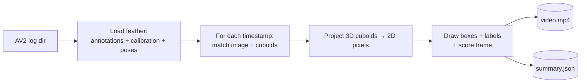
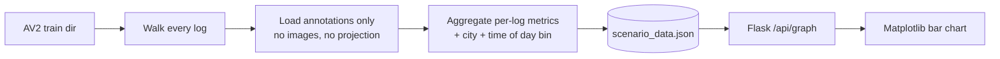

<div align="center">

<h1>AV City Comparison</h1>

<br/>

<p>
  <b>Argoverse 2 sensor logs · Per-frame complexity · City-by-city analysis.</b><br/>
  A local web app that renders annotated camera videos and compares driving difficulty across cities.
</p>

<p>
  <a href="https://www.python.org/"></a>
  <a href="https://flask.palletsprojects.com/"></a>
  <a href="https://opencv.org/"></a>
  <a href="https://numpy.org/"></a>
  <a href="https://pandas.pydata.org/"></a>
</p>

<p>
  
  
  
  
  
</p>

<p>
  <a href="#overview">Overview</a> ·
  <a href="#quick-start">Quick Start</a> ·
  <a href="#features">Features</a> ·
  <a href="#how-it-works">How It Works</a> ·
  <a href="#data-sources">Data Sources</a> ·
  <a href="#license">License</a>
</p>

</div>

---

## Overview

**AV City Comparison** is a local research tool for the [Argoverse 2 Sensor Dataset](https://www.argoverse.org/av2.html).
Point it at a folder of AV2 logs and it will, for any chosen log, project the 3D cuboid
annotations into a camera image, write an annotated MP4, and score every frame for scene
complexity — number of actors, their categories, distances, sizes, and LiDAR density.

A second pass (`extract_data.py`) walks every log in the dataset, computes the same
metrics in bulk, and dumps a single `scenario_data.json` that powers a graph builder for
city-vs-city or time-of-day-vs-complexity comparisons.

No cloud. No account. The app is a Flask server that talks to local `.feather` files and
serves a single-page UI.

<div align="center">

<table>
<tr>
<td align="center" width="33%">
<h3>Project</h3>
<sub>3D cuboids → camera frames via AV2 calibration + ego pose.</sub>
</td>
<td align="center" width="33%">
<h3>Score</h3>
<sub>Per-frame complexity from category, distance, size, density.</sub>
</td>
<td align="center" width="33%">
<h3>Compare</h3>
<sub>Bulk-extract every log → grouped bar charts per city / time of day.</sub>
</td>
</tr>
</table>

</div>

---

## Features

| | |
|---|---|
| **Annotated video render** | Pick a log + camera, get an MP4 with 3D box outlines and per-actor labels overlaid on the original frames. |
| **Per-frame complexity score** | Each frame is scored from category weights, distance falloff, object size, and LiDAR density. |
| **Bulk dataset scan** | `extract_data.py` walks every log, computes 13+ metrics per scenario, writes one `scenario_data.json`. |
| **City + time-of-day binning** | Logs are grouped by AV2 city code (PIT, MIA, ATX, …) and local time bucket (Dawn, Morning, Afternoon, Evening, Night). |
| **Graph builder** | Pick any X (city / time of day) and Y (complexity, vehicles, peds, density, LiDAR…) — get a server-rendered Matplotlib bar chart. |
| **Live render log** | Render runs as a subprocess and streams stdout to the UI over Server-Sent Events. |
| **No env, just Python** | One Flask process. Static frontend. Reads local `.feather` files directly. |
| **Theme** | Minimal dark UI, indigo accent, tabular numerics for stats. |

---

## Quick Start

> AV City Comparison is local-first — it expects an unzipped Argoverse 2 sensor split
> on disk and points to it via an env var.

```bash
# 1. Install Python deps
pip install flask opencv-python "imageio[ffmpeg]" numpy pandas scipy pyarrow matplotlib

# 2. Point the app at your AV2 split
export AV2_TRAIN_DIR=/path/to/av2/sensor/train

# 3. (Optional but recommended) Bulk-extract scenario stats once
python extract_data.py            # → static/data/scenario_data.json

# 4. Start the app
python app.py
```

Open <http://127.0.0.1:5001> and pick a log.

> macOS note: port 5000 is hijacked by AirPlay Receiver. The app uses `:5001` by default.

---

## Data Sources

You need one thing: a local copy of an Argoverse 2 Sensor Dataset split.

<table>
<tr>
  <th>Source</th>
  <th>How to get it</th>
  <th>Env var</th>
</tr>
<tr>
  <td><b>Argoverse 2 Sensor</b></td>
  <td>

  <a href="https://www.argoverse.org/av2.html#download-link">argoverse.org/av2</a> →
  download the <em>sensor</em> dataset (any split: <code>train-000</code>, <code>val</code>, etc.) → unzip anywhere

  </td>
  <td><code>AV2_TRAIN_DIR</code></td>
</tr>
</table>

The pipeline expects each log directory to contain at minimum:

```
<log_id>/
├── annotations.feather                     # 3D cuboids in ego frame
├── city_SE3_egovehicle.feather             # ego pose per timestamp
├── calibration/
│   ├── intrinsics.feather                  # camera intrinsics
│   └── egovehicle_SE3_sensor.feather       # camera extrinsics
└── sensors/cameras/<camera_name>/*.jpg     # image stream
```

`extract_data.py` only needs `annotations.feather`. The video renderer needs all of the
above for the chosen camera.

The `train/` directory is git-ignored — your dataset never gets committed.

---

## How It Works

Two pipelines feed one Flask app — a **per-log render** that produces an annotated MP4,
and a **bulk extractor** that aggregates every log into a single comparison dataset.

### The complexity score

Every actor in every frame contributes to that frame's score. Frame totals are summed
from per-actor contributions:

```
actor_score = category_weight × distance_falloff × volume_factor × lidar_density_factor
frame_score = Σ actor_score   (over every cuboid visible at that timestamp)
```

| Term | Source | Intuition |
|---|---|---|
| `category_weight` | `CATEGORY_WEIGHTS` in [`sensor_render.py`](sensor_render.py) | A bus matters more than a sign. |
| `distance_falloff` | euclidean distance from ego in metres | Close actors dominate; far ones decay. |
| `volume_factor` | `length × width × height` | Bigger boxes = more presence. |
| `lidar_density_factor` | `num_interior_pts` per cuboid | High point counts mean the actor is well-resolved. |

Tweak the weights, re-run the bulk extractor, and the graph builder picks up the new
numbers immediately.

### Render pipeline — one log → one MP4



[`sensor_render.py`](sensor_render.py) loads the feather files for one log, walks each
timestamp, projects every 3D cuboid into the chosen camera using the intrinsics +
ego→sensor extrinsics, draws the 8 box edges plus a short label, scores the frame, and
streams everything to disk via `imageio[ffmpeg]`.

### Compare pipeline — every log → one chart



[`extract_data.py`](extract_data.py) skips the image and projection work — it only needs
`annotations.feather` to score frames — and writes one row per log to
[`static/data/scenario_data.json`](static/data/scenario_data.json). The Flask app
([`app.py`](app.py)) serves the SPA, streams render subprocess output as Server-Sent
Events, and renders comparison graphs on demand. If `scenario_data.json` is missing it
falls back to whatever logs you've already rendered.

---

## Tech Stack

<table>
<tr>
<td valign="top">

**Backend**
- Python 3.10+
- [Flask 3](https://flask.palletsprojects.com/) — routing + SSE
- [Matplotlib](https://matplotlib.org/) — graph rendering (`Agg` backend)

</td>
<td valign="top">

**Data + render**
- [NumPy](https://numpy.org/) / [pandas](https://pandas.pydata.org/) — feather + tabular ops
- [PyArrow](https://arrow.apache.org/docs/python/) — `.feather` reader
- [SciPy](https://scipy.org/) — `Rotation` for SE3 → matrix
- [OpenCV](https://opencv.org/) — image draw + I/O
- [imageio + ffmpeg](https://imageio.readthedocs.io/) — MP4 writer

</td>
<td valign="top">

**Frontend**
- Vanilla HTML / CSS / JS (no build step)
- Server-Sent Events for live render log
- Single `style.css` — minimal dark theme, indigo accent

</td>
</tr>
</table>

---

## Project Structure

```
.
├── app.py                          # Flask server: routes, SSE, graph endpoint
├── sensor_render.py                # AV2 → annotated MP4 + summary.json (per-log)
├── extract_data.py                 # bulk per-log metrics → scenario_data.json
├── templates/
│   └── index.html                  # single-page layout
├── static/
│   ├── style.css                   # theme + layout
│   ├── app.js                      # log/camera selector, render SSE, stats, graph
│   ├── data/
│   │   └── scenario_data.json      # generated by extract_data.py
│   └── output/<log_id>/
│       ├── video.mp4               # rendered annotated video
│       └── summary.json            # per-render frame scores + averages
├── train/                          # AV2 logs (git-ignored)
└── README.md
```

---

## Scripts

| Command | What it does |
|---|---|
| `python app.py` | Start the Flask app on `:5001`. |
| `python extract_data.py` | Walk every log in `$AV2_TRAIN_DIR` and write `static/data/scenario_data.json`. |
| `python sensor_render.py --log-dir <path> --camera ring_front_center --output-video out.mp4 --output-json out.json` | Render one log directly from the CLI. |

---

## Configuration

<details>
<summary><b>Environment variables</b></summary>

| Variable | Required | Purpose |
|---|---|---|
| `AV2_TRAIN_DIR` | yes | Absolute path to your unzipped Argoverse 2 sensor split (the folder containing the `<log_id>/` dirs). Defaults to `./train`. |

</details>

<details>
<summary><b>Tuning the complexity score</b></summary>

Scoring weights live at the top of `sensor_render.py`:

- `CATEGORY_WEIGHTS` — per-class base weight (BUS = 4.0, PEDESTRIAN = 2.8, SIGN = 0.4, …)
- distance falloff, volume factor, and LiDAR density factor are applied inside `actor_score()`

Tweak the weights, re-run `extract_data.py`, and the graph builder picks up the new
`scenario_data.json` immediately.

</details>

<details>
<summary><b>Adding new graph axes</b></summary>

The graph endpoint in `app.py` reads any field present on each scenario row. To expose
a new metric:

1. Compute it in `_extract_log_stats()` in `extract_data.py`.
2. Re-run `python extract_data.py`.
3. Add an `<option value="your_field">…</option>` to the `#yAxisSelect` in
   `templates/index.html` and a label in the `y_labels` dict in `app.py`.

</details>

<details>
<summary><b>macOS port 5000</b></summary>

macOS binds port 5000 to AirPlay Receiver, which returns HTTP 403 to anything else.
The app runs on `:5001` by default. To use `:5000`, disable AirPlay Receiver in
*System Settings → General → AirDrop & Handoff*.

</details>

---

## Acknowledgments

- [**Argoverse**](https://www.argoverse.org/av2.html) — for releasing the sensor dataset and the cuboid + calibration schema this project depends on.
- [**OpenCV**](https://opencv.org/), [**imageio**](https://imageio.readthedocs.io/) and [**ffmpeg**](https://ffmpeg.org/) — for the image and video pipeline.
- [**Matplotlib**](https://matplotlib.org/) — for the server-rendered comparison charts.
- [**Flask**](https://flask.palletsprojects.com/) — for keeping the backend small.

> This project uses the Argoverse 2 dataset under its [terms of use](https://www.argoverse.org/about.html#terms-of-use) and is not affiliated with or endorsed by Argo AI.

---

## License

See the [MIT](LICENSE) file for details